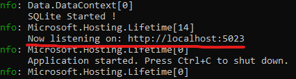

# API desenvolvida para Teste Técnico

Sistema para exibir dados do 'Golden Raspberry Awards' contidos em um arquivo .csv
````
git clone https://github.com/HugoPB/GoldenRaspberryAwards.git
````

## Instruções

- Executar
  - [Aplicação](#inicializar-aplicação)
  - [Testes](#executar-testes)
- Mudança de arquivo .csv
  - [Subistituindo arquivo](#alterando-arquivo-de-dados)


## Inicializar Aplicação

Abra a pasta onde o repositorio foi clonado e navegue até.
> \Golden Raspberry Awards

Então execute o comando:
> dotnet run

Para identificar a porta a qual acessar a aplicação, basta observar o resultado do comando



## Executar Testes

Abra a pasta onde o repositorio foi clonado e execute o comando.
> dotnet test

## Alterando arquivo de Dados

Para alterar o arquivo que carrega as informações no Banco de Dados em memória, é necessário subistituir o arquivo na seguinte pasta.
> GoldenRaspberryAwards\Data\CSVData\Movielist.csv

Para garantir o funcionamento da aplicação deve-se manter a <b>mesma formatação</b> e <b>nome do arquivo</b> anteriormente substituído